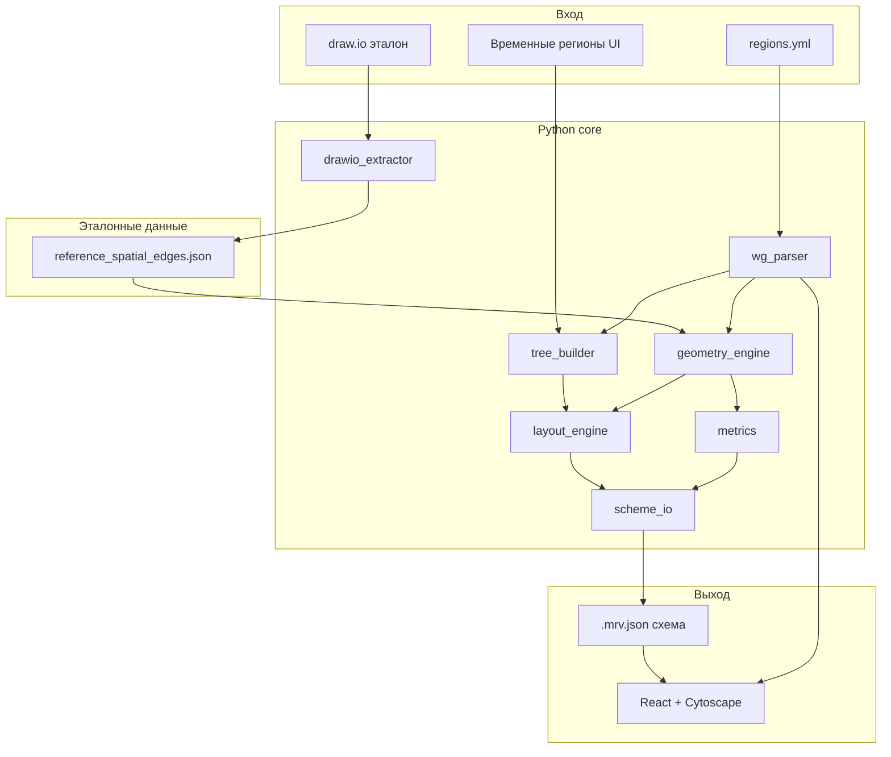

# План: Minecraft Regions Viewer

## Контекст и масштаб

Исходные данные уже есть в репозитории (файлы **только для чтения**, см. запрет ниже):
- [`regions.yml`](c:\Users\seraf\Documents\MY_DOCS\AI\разное\minecraft_regions_viewer\regions.yml) — 403 региона: 308 `cuboid`, 34 `poly2d`, 61 `global`; иерархия через `parent`
- [`all_flags.txt`](c:\Users\seraf\Documents\MY_DOCS\AI\разное\minecraft_regions_viewer\all_flags.txt) — справочник флагов (имя + тип + описание)
- [`task.txt`](c:\Users\seraf\Documents\MY_DOCS\AI\разное\minecraft_regions_viewer\task.txt) — ТЗ
- [`Приватные регионы иерархия`](c:\Users\seraf\Documents\MY_DOCS\AI\разное\minecraft_regions_viewer\Приватные регионы иерархия) — ручная draw.io-схема; **эталон пересечений** (неполный, см. ниже)

**Запрет на изменение** `task.txt`, `all_flags.txt`, `regions.yml` — **первое действие** агента при старте: `.cursor/rules/no-edit-reference-files.mdc` + `AGENTS.md` (см. этап 1, шаг 0).

Пример структуры региона:

```yaml
metro_express_tunnel_60:
    parent: metro_express_tunnel
    min: {x: -1219, y: -41, z: 5410}
    max: {x: -1214, y: -30, z: 5428}
    type: cuboid
    priority: 0
```

Корневые узлы — регионы **без** поля `parent` (например `root`, `far_far_away_main`, `ust_yuryung_khaya`).

### Эталон пересечений из draw.io

Файл [`Приватные регионы иерархия`](c:\Users\seraf\Documents\MY_DOCS\AI\разное\minecraft_regions_viewer\Приватные регионы иерархия) — mxGraph XML (draw.io). Содержит легенду и ~217 рёбер, из них:

| Тип связи | Признак в XML | Подпись в легенде |
|-----------|---------------|-------------------|
| Иерархия (parent→child) | `endArrow=classic`, `strokeWidth=2`, без `dashed=1` | «Является родителем» |
| Пересечение | `dashed=1`, `endArrow=none` | «Области пересекаются» |
| Вхождение | `endArrow=doubleBlock` (часто + `dashed=1`) | «Область А входит в Б» |

Подписи узлов: формат `priority; region_name` (иногда в HTML: `&lt;span&gt;0; the_wall_bridge_south_1&lt;/span&gt;`).

**Ограничения эталона** (учитывать при тестах):
- Данные **не гарантированы на 100%** — часть пересечений могла быть пропущена вручную
- Эталон покрывает **нарисованные** связи (~29–40 intersection-рёбер), а не все ~81k теоретических пар
- Рёбра легенды (`locked=1`, `connectable=0`, узлы «А»/«Б») **исключаются** при извлечении
- Вхождения (`doubleBlock`) в схеме встречаются редко (2–3 шт.) — использовать как дополнительную проверку, не как основной набор

На этапе реализации — **один раз** извлечь данные в структурированный файл, draw.io при тестах не парсить.

---

## Выбранный стек

| Слой | Технология | Почему |
|------|------------|--------|
| Ядро | Python 3.11+ | Парсинг YAML, геометрия, тесты (pytest), быстрая разработка |
| Геометрия | `shapely` (poly2d), собственный AABB (cuboid) | Надёжные пересечения/вхождения полигонов в плоскости XZ |
| API/запуск | `FastAPI` + `uvicorn` | Локальный сервер, отдача статики и JSON API |
| UI | React + TypeScript + Vite + **Cytoscape.js** | Pan/zoom, collapse, кастомные формы, много рёбер |
| Тесты | `pytest` | Покрытие парсера, геометрии, дерева, сериализации |
| Сборка | `npm run build` → статика в `backend/static/` | Один `run.bat` / `run.sh` для запуска |

Альтернатива (Electron) отклонена: лишняя сложность при том же результате — локальный браузер + Python-сервер.

---

## Архитектура



**Разделение данных:**
- **Схема (`.mrv.json`)** — дерево, узлы, рёбера иерархии, рёбера пересечений/вхождений, layout-позиции, метрики, хэш исходного YAML. Не зависит от параметров отображения.
- **Состояние просмотра** — zoom/pan, collapse, `depthScale` — хранится отдельно (localStorage + опционально `.mrv.view.json` рядом со схемой).

---

## Структура проекта

```
minecraft_regions_viewer/
├── task.txt                    # НЕ ТРОГАТЬ (ТЗ)
├── all_flags.txt               # НЕ ТРОГАТЬ (справочник флагов)
├── regions.yml                 # НЕ ТРОГАТЬ (пример данных, только чтение)
├── Приватные регионы иерархия  # draw.io, только для извлечения эталона (не парсить в runtime)
├── data/
│   └── reference_spatial_edges.json  # извлечённые пары пересечений/вхождений
├── backend/
│   ├── main.py                 # FastAPI entry
│   ├── models/region.py        # dataclasses: Cuboid, Poly2d, Global
│   ├── parser/wg_parser.py       # YAML → Region[]
│   ├── tree/builder.py         # parent → Forest
│   ├── geometry/intersections.py # AABB + shapely
│   ├── layout/hierarchical.py  # позиции узлов (dagre-подобный)
│   ├── metrics/compute.py
│   ├── scheme/io.py            # save/load .mrv.json
│   ├── flags/catalog.py        # парсер all_flags.txt
│   ├── tools/extract_drawio_reference.py  # одноразовый/повторный экстрактор
│   └── tests/                  # pytest
├── frontend/
│   ├── src/
│   │   ├── App.tsx
│   │   ├── components/GraphView.tsx
│   │   ├── components/RegionPanel.tsx
│   │   ├── components/MetricsPanel.tsx
│   │   ├── components/AddRegionDialog.tsx
│   │   └── cytoscape/styles.ts
│   └── package.json
├── docs/
│   ├── ИНСТРУКЦИЯ.md           # руководство пользователя (пополняется по мере готовности блоков)
│   └── dev/
│       ├── STATUS.md           # точка входа при возобновлении (читать первым!)
│       ├── STATE.yaml          # машиночитаемый снимок STATUS
│       ├── PROGRESS.md         # append-only хронология
│       ├── DECISIONS.md        # архитектурные решения
│       ├── KNOWN_ISSUES.md     # баги, блокеры
│       └── REFERENCE_DIFF.md   # расхождения с draw.io-эталоном
├── .cursor/rules/no-edit-reference-files.mdc  # запрет: task.txt, all_flags.txt, regions.yml
├── run.bat / run.sh
├── requirements.txt
└── README.md                   # установка, запуск, ссылка на docs/ИНСТРУКЦИЯ.md
```

`README.md` — только установка и запуск. **Как пользоваться программой** — в [`docs/ИНСТРУКЦИЯ.md`](docs/ИНСТРУКЦИЯ.md), обновляется инкрементально после каждого готового блока.

---

## Модель данных

### Region (ядро)

```python
@dataclass
class Region:
    id: str
    type: Literal["cuboid", "poly2d", "global", "manual"]
    parent: str | None
    priority: int
    flags: dict
    owners: dict
    members: dict
    # spatial (optional):
    min: Vec3 | None
    max: Vec3 | None
    min_y: int | None
    max_y: int | None
    points: list[Vec2] | None
    is_manual: bool  # без координат, только для сессии/схемы
```

### Типы пространственных связей

- `intersects` — частичное пересечение объёмов (cuboid↔cuboid, cuboid↔poly2d, poly2d↔poly2d)
- `contains` — полное вхождение A в B (или B в A; хранить направленно)
- `global` — **не участвует** в пространственных расчётах (нет точек в пространстве)
- `manual` — без координат, только в дереве, без spatial-рёбер

### Геометрия

- **Cuboid volume**: `(max.x - min.x + 1) * (max.y - min.y + 1) * (max.z - min.z + 1)` (инклюзивные координаты WorldGuard)
- **Poly2d volume**: `polygon_area(x,z) * (max_y - min_y + 1)`
- **Cuboid intersection**: пересечение AABB по X, Y, Z
- **Poly2d intersection**: пересечение Shapely-полигонов в XZ + пересечение Y-диапазонов
- **Смешанные**: poly2d → bounding box → быстрый reject → точная проверка
- **Сложность**: O(n²) ≈ 81k пар для 403 регионов — приемлемо (< 1–2 сек)

### Извлечение эталона из draw.io

Скрипт [`backend/tools/extract_drawio_reference.py`](backend/tools/extract_drawio_reference.py):

1. Парсит mxGraph XML (stdlib `xml.etree`)
2. Строит карту `cell_id → region_name` из вершин с `value`, содержащим `; ` (regex: `(\d+);\s*([a-zA-Z0-9_-]+)` с очисткой HTML)
3. Извлекает рёбра `edge="1"`:
   - **intersects**: `dashed=1` в style, нет `locked=1`, есть `source` + `target`
   - **contains**: `endArrow=doubleBlock`, есть `source` + `target`, не легенда
4. Нормализует пары: `{a, b}` сортировка для intersects; `{inner, outer}` направленно для contains (по `source`→`target` как «А входит в Б»)
5. Пишет [`data/reference_spatial_edges.json`](data/reference_spatial_edges.json):

```json
{
  "schemaVersion": 1,
  "source": "Приватные регионы иерархия",
  "extractedAt": "2026-07-10",
  "disclaimer": "Неполный ручной эталон; пропуски ожидаемы",
  "intersects": [["region_a", "region_b"], ...],
  "contains": [["inner", "outer"], ...],
  "stats": { "intersects": 29, "contains": 2, "skippedLegendEdges": 2 }
}
```

---

## Функциональные блоки

### 1. Загрузка YAML
- Кнопка «Открыть файл» → `POST /api/load` или file picker + upload
- Валидация: неизвестный `type`, битый `parent`, циклы в иерархии → ошибка с понятным сообщением
- Регионы без `parent` — корневые узлы леса (не подмешивать автоматически к `root`, если parent не указан)

### 2. Построение и сохранение схемы
- Кнопка «Построить схему» → парсинг + дерево + пересечения + layout + метрики
- Сохранение в `.mrv.json` (версионированный формат `schemaVersion: 1`)
- Кнопка «Открыть схему» — загрузка без пересчёта; сравнение `sourceHash` с исходным YAML (предупреждение при расхождении)
- При открытии схемы после перезапуска — сразу рендер графа

### 3. Визуализация (Cytoscape.js)
- **Pan/zoom**: встроенные жесты Cytoscape + колёсико мыши
- **Иерархические рёбера**: сплошные, parent → child
- **Spatial-рёбера**: пунктир/другой цвет — `intersects`; жирная стрелка — `contains`
- **Цвета по depth**: палитра с гарантией `color(parent) != color(child)` (HSL: `hue = (depth * 137.5) % 360`)
- **Формы**: обычные — ellipse; `global`/`manual` — кастомный SVG «облако» через `background-image`
- **Размер по depth**: `nodeSize = baseSize * depthScale^depth` — параметр в UI (slider + «Применить», без live-rebuild)
- **Подпись узла**: `name`, `priority`, `depth`
- **Копирование имени**: кнопка в tooltip / контекстное меню → clipboard
- **Клик по узлу**: модальное окно — type, parent, priority, owners/members, координаты; кнопка «Флаги» → таблица (scroll при >15 флагов), типы из `all_flags.txt`

### 4. Collapse / Expand
- `+` / `−` на узле: скрыть/показать прямых детей
- «Свернуть рекурсивно» / «Развернуть рекурсивно»
- **Перенаправление рёбер** (п.9 ТЗ): при скрытии потомка все его spatial-рёбра переназначаются на ближайшего видимого предка; дедупликация пар; тип ребра сохраняется (если конфликт — брать «сильнейший»: `contains` > `intersects`)

### 5. Добавление временного региона
- Диалог: id, parent, type, priority, flags (редактор key-value), owners/members
- **Без координат** — `is_manual=true`, форма «облако»
- Живёт в схеме до перезагрузки нового YAML; помечается визуально (иконка/рамка)

### 6. Метрики (отдельная кнопка / панель)
- 6.1: общее количество регионов (с разбивкой по type)
- 6.2.1: топ по объёму блоков (global/manual → «N/A», внизу списка)
- 6.2.2: топ по числу точек (только poly2d)
- 6.2.3: топ по числу spatial-пересечений

---

## API (минимальный)

| Endpoint | Назначение |
|----------|------------|
| `POST /api/parse` | загрузить YAML, вернуть preview (count, errors) |
| `POST /api/build` | построить схему в памяти |
| `POST /api/scheme/save` | сохранить `.mrv.json` |
| `POST /api/scheme/load` | загрузить схему |
| `GET /api/flags` | справочник флагов |
| `POST /api/regions/manual` | добавить временный регион |

---

## Тестирование (pytest)

Приоритетные тест-кейсы в [`backend/tests/`](backend/tests/):

1. **Парсер**: cuboid, poly2d, global, пустые flags, многострочные flags
2. **Дерево**: лес из нескольких корней, цикл parent → ошибка
3. **Объём**: cuboid 1×1×1, poly2d с 4 точками
4. **Пересечения**: два пересекающихся cuboid; непересекающиеся; cuboid внутри cuboid → `contains`
5. **Poly2d**: пересечение полигонов, touch-only (граница) — зафиксировать поведение: touch ≠ intersect
6. **Global/manual**: не дают spatial-рёбер
7. **Collapse remap**: скрытый ребёнок → ребро идёт к родителю
8. **Scheme I/O**: round-trip `.mrv.json`
9. **Валидация по draw.io-эталону** ([`backend/tests/test_reference_intersections.py`](backend/tests/test_reference_intersections.py)):
   - Загрузить `regions.yml` + `data/reference_spatial_edges.json`
   - Для каждой пары из `intersects[]`: алгоритм **должен** найти пересечение → `pytest` fail при расхождении
   - Для каждой пары из `contains[]`: алгоритм **должен** найти вхождение
   - Пары, найденные алгоритмом, но **отсутствующие** в эталоне — **не fail**, а отчёт в `docs/dev/REFERENCE_DIFF.md` (ожидаемые пропуски в ручной схеме)
   - При обновлении draw.io: перезапустить `extract_drawio_reference.py`, пересмотреть diff

После каждого значимого этапа: `pytest` → локальный git commit.

---

## Процесс разработки (требования из task.txt)

1. `git init` в начале; коммиты после этапов (парсер, геометрия, UI, тесты…)
2. **Логи в `docs/dev/`** — обязательная «внешняя память» (контекст 200k токенов может обнуляться). Подробные правила — в разделе ниже.
3. **Запрет на изменение исходных файлов** — `task.txt`, `all_flags.txt`, `regions.yml` (правило в `.cursor/rules/` + `AGENTS.md`; **создать первым делом**, до любого кода)
4. Финал: README (установка/запуск), [`docs/ИНСТРУКЦИЯ.md`](docs/ИНСТРУКЦИЯ.md) (полное руководство), `run.bat`, готовность к push на GitHub
5. **Инструкция пользователя** пополняется сразу после каждого готового и протестированного блока (правила — в разделе ниже)

---

## Правила ведения логов (внешняя память)

Логи — главный способ восстановить контекст за **< 2k токенов** чтения. Код и git diff — только если логов недостаточно.

### Файлы и их роли

| Файл | Назначение | Когда писать | Лимит размера |
|------|------------|--------------|---------------|
| [`STATUS.md`](docs/dev/STATUS.md) | **Точка входа** при возобновлении: фаза, блокеры, 3 следующих шага | Обновлять в конце **каждой** сессии и после **каждого** этапа плана | ≤ 80 строк |
| [`STATE.yaml`](docs/dev/STATE.yaml) | То же, в YAML — для быстрого парсинга агентом | **Синхронно** с STATUS.md при каждом его обновлении | ≤ 40 строк |
| [`PROGRESS.md`](docs/dev/PROGRESS.md) | Хронология: что сделано, коммиты, результаты тестов | Append-only после каждого значимого действия | без лимита, но записи короткие |
| [`DECISIONS.md`](docs/dev/DECISIONS.md) | Неочевидные решения (почему X, а не Y) | При выборе алгоритма, формата, поведения | по необходимости |
| [`KNOWN_ISSUES.md`](docs/dev/KNOWN_ISSUES.md) | Нерешённые проблемы, костыли | При баге > 15 мин или принятом workaround | актуализировать, закрывать `[RESOLVED]` |
| [`REFERENCE_DIFF.md`](docs/dev/REFERENCE_DIFF.md) | Лишние пересечения алгоритма vs draw.io | После `test_reference_intersections` и прогона на `regions.yml` | таблица, обновлять при изменении геометрии |

### Протокол при возобновлении работы

1. Прочитать `STATUS.md` **или** `STATE.yaml` (достаточно одного; YAML короче)
2. Если нужны детали последних шагов — последние **5 записей** в `PROGRESS.md` (снизу)
3. Если есть `[BLOCKED]` / `blockers` не пуст — прочитать `KNOWN_ISSUES.md`
4. Приступать к `next_steps[0]` из STATUS/STATE

### Когда писать (триггеры)

| Событие | Куда | Обязательно? |
|---------|------|--------------|
| Старт проекта / этапа | PROGRESS + STATUS | да |
| Создан/изменён значимый файл (модуль, компонент) | PROGRESS | да |
| `pytest` (любой запуск) | PROGRESS (pass/fail + число) | да |
| `git commit` | PROGRESS (hash + message) + STATUS + STATE.yaml | да |
| Архитектурный выбор (формат JSON, правило intersect) | DECISIONS + PROGRESS (ссылка) | да |
| Баг / застрял > 15 мин | KNOWN_ISSUES + STATUS `[BLOCKED]` | да |
| Баг исправлен | KNOWN_ISSUES `[RESOLVED]` + PROGRESS | да |
| Расхождение с draw.io-эталоном | REFERENCE_DIFF | при прогоне геометрии |
| Блок функциональности готов + тесты OK | ИНСТРУКЦИЯ.md + PROGRESS `[DOC]` | да |
| Конец сессии / перед длинной задачей | STATUS + STATE.yaml (полное обновление) | **обязательно** |
| Мелкий фикс (опечатка, импорт) | не логировать | — |

### Формат записи в PROGRESS.md

Каждая запись — один блок, **append в конец файла**:

```markdown
## 2026-07-10 17:30 | этап-3 | geometry

- [DONE] `backend/geometry/intersections.py` — AABB + poly2d через shapely
- [DONE] `backend/tests/test_intersections.py` — 12 passed
- [COMMIT] `a1b2c3d` — add cuboid/poly2d intersection engine
- [NEXT] reference test против draw.io
```

**Правила строк:**
- Префиксы: `[DONE]` `[WIP]` `[TODO]` `[BLOCKED]` `[COMMIT]` `[TEST]` `[DECISION]` `[FILE]` `[DOC]`
- Пути — относительные от корня проекта
- Одна строка = один факт, без абзацев
- Дата `YYYY-MM-DD HH:MM`, этап — id из плана (`scaffold`, `parser-models`, `drawio-reference`, …)
- Не копировать код в лог — только путь к файлу
- Не дублировать содержимое DECISIONS — писать `[DECISION] см. DECISIONS.md#якорь`

### Формат STATUS.md (перезаписывается целиком)

```markdown
# STATUS — обновлено 2026-07-10 17:30

## Текущая фаза
этап-3: geometry-tree [WIP]

## Завершено (кратко)
- парсер regions.yml (403 региона)
- draw.io → reference_spatial_edges.json (29 intersects)

## В работе
- geometry/intersections.py — poly2d+cuboid mixed pairs

## Следующие 3 шага
1. Дописать test_reference_intersections.py
2. pytest + commit
3. Начать layout/hierarchical.py

## Блокеры
- нет

## Последний коммит
a1b2c3d — add cuboid/poly2d intersection engine

## Тесты
pytest: 24 passed, 0 failed (2026-07-10 17:28)
```

### Формат STATE.yaml (синхронно с STATUS.md)

```yaml
updated: "2026-07-10T17:30"
phase: { id: geometry-tree, plan_todo: geometry-tree, status: WIP }
done:
  - parser regions.yml (403 regions)
  - draw.io → reference_spatial_edges.json (29 intersects)
wip:
  - backend/geometry/intersections.py
next_steps:
  - test_reference_intersections.py
  - pytest + commit
  - layout/hierarchical.py
blockers: []
last_commit: { hash: a1b2c3d, message: "add cuboid/poly2d intersection engine" }
tests: { passed: 24, failed: 0, at: "2026-07-10T17:28" }
```

### Формат DECISIONS.md

```markdown
## 2026-07-10 | touch ≠ intersect

**Контекст:** граничащие cuboid по одной грани
**Решение:** touch-only не считается пересечением
**Причина:** соответствует легенде draw.io «области пересекаются»
**Файлы:** backend/geometry/intersections.py
```

### Формат REFERENCE_DIFF.md

Только таблица, без текста:

```markdown
| region_a | region_b | тип | в эталоне | в алгоритме | примечание |
|----------|----------|-----|-----------|-------------|------------|
| foo | bar | intersect | нет | да | ожидаемо — пропуск в draw.io |
```

### Антипаттерны (запрещено)

- Писать «сделал парсер» без пути к файлу
- Дублировать один и тот же факт в PROGRESS и STATUS (STATUS — только сжатое резюме)
- Вести один огромный неструктурированный лог
- Полагаться на память чата вместо записи в STATUS перед паузой
- Изменять старые записи в PROGRESS (только append; исправления — новая строка с `[FIX]`)

### Связь логов с git

- Каждый коммит этапа → строка `[COMMIT] hash — message` в PROGRESS
- STATUS всегда содержит hash последнего коммита
- При откате (`git revert` / `reset`) — запись `[REVERT] hash — причина` в PROGRESS + обновить STATUS

---

## Инструкция пользователя (`docs/ИНСТРУКЦИЯ.md`)

Живой документ **для вас** — как работать с программой. Не смешивать с dev-логами; `README.md` — только установка и запуск + ссылка сюда.

### Workflow (обязательный порядок)

```
код → тесты (pass) → раздел в ИНСТРУКЦИЯ.md → [DOC] в PROGRESS → commit
```

**Триггер:** функциональный блок реализован целиком **и** протестирован (`pytest` + ручная проверка UI, если есть интерфейс). Не ждать финала проекта.

Backend-only блоки в инструкцию **не писать**, пока функция не доступна в UI (кроме «Установка и запуск»).

### Разделы (заполняются по готовности)

| Раздел | Когда готов |
|--------|-------------|
| Установка и запуск | Этап 1 |
| Загрузка файла регионов | Этап 6 (file picker) |
| Построение схемы | Этап 6 |
| Сохранение и открытие схемы (`.mrv.json`) | Этап 4–6 |
| Навигация: прокрутка и масштаб | Этап 5 |
| Узлы: цвета, формы, подписи | Этап 5 |
| Просмотр региона, флаги, копирование имени | Этап 5 |
| Сворачивание / разворачивание | Этап 5 |
| Пересечения и вхождения на схеме | Этап 5 |
| Масштаб по уровню вложенности | Этап 6 |
| Добавление временного региона | Этап 6 |
| Метрики | Этап 6 |
| Форматы файлов и ограничения | Этап 7 |

При доработке блока — **обновлять** существующий раздел, не плодить дубликаты.

### Формат раздела

```markdown
## Сохранение схемы

Схема — готовый результат построения. Её можно открыть позже без пересчёта.

### Как сохранить
1. Постройте схему (кнопка «Построить схему»).
2. Нажмите «Сохранить схему».
3. Укажите путь, например `my_world.mrv.json`.

### Как открыть
1. «Открыть схему» → выберите `.mrv.json`.

### Примечания
- Если `regions.yml` изменился, программа предупредит о расхождении.
```

**Правила:** русский язык, обращение на «вы»; шаги нумерованные; кнопки в «ёлочках»; без имён классов/API; незавершённые функции — раздел не создавать.

### Стартовый каркас (этап 1)

`docs/ИНСТРУКЦИЯ.md`: заголовок, оглавление (пункты добавляются по мере готовности), заполнен только раздел «Установка и запуск».

### Связь с логами

| Событие | Действие |
|---------|----------|
| Блок готов + тесты OK | Новый/обновлённый раздел в `ИНСТРУКЦИЯ.md` |
| То же | `PROGRESS`: `[DOC] docs/ИНСТРУКЦИЯ.md — раздел «…»` |
| Конец этапа | Проверить, что готовые блоки этапа описаны в инструкции |
| Опционально | В `STATUS.md` → «инструкция: N разделов готово» |

---

## Этапы реализации (порядок)

### Этап 1 — Каркас (0.5 дня)

**Шаг 0 (до всего остального):** создать `.cursor/rules/no-edit-reference-files.mdc` и запись в `AGENTS.md`:
- **Нельзя** изменять, удалять, переименовывать: `task.txt`, `all_flags.txt`, `regions.yml`
- **Можно** только читать эти файлы (парсинг, тесты, загрузка в UI через file picker — из копии или пути пользователя, не перезаписывая оригинал в репозитории)

Затем:
- Git, структура папок, `requirements.txt`, `package.json`
- FastAPI skeleton + статика
- Шаблоны логов: `STATUS.md`, `STATE.yaml`, `PROGRESS.md`, `DECISIONS.md`, `KNOWN_ISSUES.md`
- Заготовка `docs/ИНСТРУКЦИЯ.md` (оглавление + «Установка и запуск» после проверки `run.bat`)
- Обязательное обновление STATUS+STATE в конце сессии

### Этап 2 — Парсер и модели (1 день)
- `wg_parser.py`, `flags/catalog.py`
- Тесты на реальных фрагментах из `regions.yml`

### Этап 2.5 — Эталон из draw.io (0.25 дня)
- `tools/extract_drawio_reference.py` → `data/reference_spatial_edges.json`
- Ручная проверка 3–5 пар по легенде; зафиксировать правила в `DECISIONS.md`

### Этап 3 — Дерево и геометрия (1–1.5 дня)
- `tree/builder.py`, `geometry/intersections.py`, `metrics/compute.py`
- Тесты пересечений, объёмов и `test_reference_intersections.py`

### Этап 4 — Layout и схема (0.5–1 день)
- `layout/hierarchical.py`, `scheme/io.py`
- Сохранение/загрузка `.mrv.json`

### Этап 5 — UI: граф (1.5–2 дня)
- Cytoscape: рендер, pan/zoom, цвета, формы, подписи
- Collapse/expand + remap рёбер
- Region panel, copy name, flags table
- ИНСТРУКЦИЯ: навигация, просмотр региона, сворачивание, пересечения

### Этап 6 — UI: остальной функционал (1 день)
- File picker, build/save/load scheme
- Add manual region dialog
- Metrics panel, depth scale slider
- ИНСТРУКЦИЯ: загрузка YAML, построение/сохранение схемы, черновик региона, метрики, depthScale

### Этап 7 — Полировка (0.5 дня)
- `run.bat`, README (ссылка на ИНСТРУКЦИЯ.md)
- Прогон на полном `regions.yml` (403 региона)
- Финальная вычитка `docs/ИНСТРУКЦИЯ.md` (раздел «Форматы файлов и ограничения»)
- Финальные тесты, последний commit

**Оценка: ~6–8 рабочих дней**

---

## Риски и mitigations

| Риск | Решение |
|------|---------|
| Визуальный шум от тысяч intersection-рёбер | Кривые Безье, полупрозрачность, разные z-index; при необходимости — минимальная толщина и bundling в Cytoscape |
| Большие poly2d (historical_center_main — 50+ точек) | Shapely + bounding-box precheck; тесты на реальном полигоне |
| Регионы-сироты без parent | Показывать как отдельные корни; в метриках не скрывать |
| Производительность layout при 400+ узлах | Предрасчёт позиций в Python, UI только отображает |
| Неполный draw.io-эталон | Тесты: fail только если эталон говорит «есть», а алгоритм — «нет»; лишние находки алгоритма — в diff-отчёт |
| Путаница иерархии и пересечений в draw.io | Различать по `dashed=1` / `endArrow=classic`; легенду фильтровать по `locked=1` |
| Потеря контекста (200k окно) | STATUS.md + короткий PROGRESS; протокол возобновления в начале каждой сессии |

---

## Критерии готовности

- [ ] Открывается любой WorldGuard `regions.yml` из файла
- [ ] Схема сохраняется и открывается без пересчёта после перезапуска
- [ ] Все spatial-пересечения и вхождения отображаются на графе
- [ ] Работают collapse/expand (в т.ч. рекурсивно) с переназначением рёбер
- [ ] Можно добавить временный регион без координат
- [ ] Метрики выводятся отдельной панелью
- [ ] `pytest` проходит; git-история с осмысленными коммитами
- [ ] Эталон `reference_spatial_edges.json` извлечён; все пары из эталона подтверждаются алгоритмом
- [ ] `STATUS.md` + `STATE.yaml` актуальны; `PROGRESS.md` покрывает все этапы и коммиты
- [ ] `docs/ИНСТРУКЦИЯ.md` описывает все реализованные функции (без заглушек «в разработке» для готовых блоков)
- [ ] `task.txt`, `all_flags.txt`, `regions.yml` не изменены
